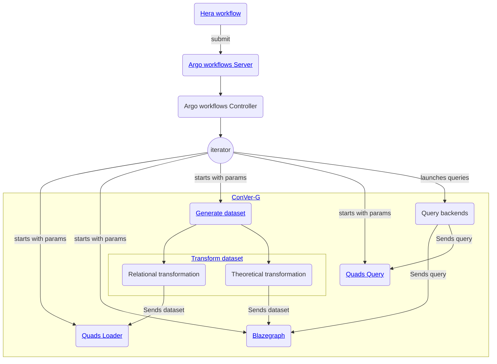

# Project Documentation

## Overview
This project is designed to store the experiment metrics.

## Usage
To use the project, follow these steps:
1. Create a postgresql database.
2. Use the provided SQL script to create the schema.
3. <python part>

## Hera workflow
    
```shell
# set the environment variables
export POSTGRES_USER="<username>" 
export POSTGRES_PASSWORD="<password>"

# print the help
python experiment.py --help

# execute the experiment
python experiment.py --versions 1 10 100 1000 --products 5 20 80 350 --steps 1 5 10 50
```



## Contributing
If you would like to contribute to this project, please follow these guidelines:
1. Fork the repository.
2. Create a new branch:
    ```sh
    git checkout -b [branch name]
    ```
3. Make your changes and commit them:
    ```sh
    git commit -m "[commit message]"
    ```
4. Push to the branch:
    ```sh
    git push origin [branch name]
    ```
5. Create a pull request.

## License
This project is licensed under the GNU Lesser General Public License v2.1. See the [LICENSE](LICENSE) file for more details.
